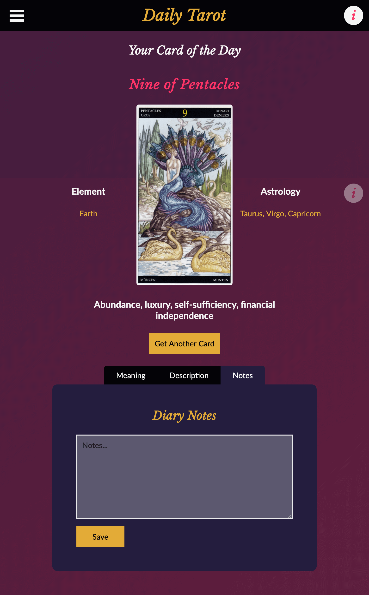

# Daily Tarot App
## Full Stack, Fully CRUD React App with Custom API
### > For V School // Full Stack JavaScript // January 2019 Cohort

#### Screenshot:

#### Launch:
- <a href="https://daily-tarot-reader.herokuapp.com" target="_blank">Full Stack Tarot App</a>

#### YouTube Demo:

#### Completed according to assignment reqirements: 
- A passed-off proposal explaining the app
- Uses React on the front-end
- Is a single-page application (SPA)
- Is responsive
- Is well organized, using Context and Axios where applicable/useful.
- Uses Node.js/Express as the back-end server
- Shows a good understanding of module patterns by separating components, containers, etc. into their own folders and files
- Uses express routers
- Uses MongoDB for the database and Mongoose for schema creation and the ODM (Object-Document Mapper)
- Has user authentication using json web tokens, express-jwt, bcrypt, and dotenv.
