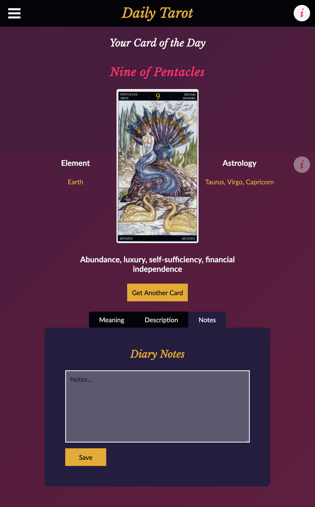

# Daily Tarot

A full-stack tarot card reading app. Log in, draw a card of the day, jot down notes on the reading, and look back through past dailies.

**Live:** <a href="https://yummy-wakame.com/demos/daily-tarot" target="_blank">yummy-wakame.com/demos/daily-tarot</a>

<a href="https://yummy-wakame.com/demos/daily-tarot" target="_blank"></a>

#### YouTube Demo
<a href="https://youtu.be/m16gMcxs2N0" target="_blank"></a>

---

## Tech Stack

- **Frontend:** React 18, React Router, Axios, Vite
- **Backend:** Node.js, Express 5
- **Database:** MongoDB Atlas, Mongoose
- **Auth:** JSON Web Tokens (`jsonwebtoken`), passwords hashed with `bcryptjs`
- **Other:** Helmet (CSP), Joi validation, express-rate-limit, dotenv

## Getting Started

### Prerequisites
- Node.js >= 20
- A MongoDB Atlas connection string

### Install

```bash
# Backend
npm install

# Frontend
cd client && npm install && cd ..
```

### Configure

Copy `.env.example` to `.env` in the project root and fill in the values:

```
MONGODB_URI=<Atlas connection string>
SECRET=<long random JWT signing secret>
PORT=7000           # optional, defaults to 7000
NODE_ENV=development
```

### Run

```bash
# Build the frontend for local use (root-relative asset paths)
cd client && npm run build:local && cd ..

# Start the server
npm start
# → http://localhost:7000
```

For frontend hot-reload while developing, run `cd client && npm run dev` (port 3000) alongside the backend on port 7000 instead.

Full local-dev details (including the Windows/Laragon setup used for this project) and deployment notes live in [AGENTS.md](./AGENTS.md).

---

## Project Origin

Originally built for V School's Full Stack JavaScript program (January 2019 cohort) as a full CRUD React app with a custom API, and has been maintained and modernized since. Assignment requirements met:

- A passed-off proposal explaining the app
- Uses React on the front-end
- Is a single-page application (SPA)
- Is responsive
- Is well organized, using Context and Axios where applicable/useful
- Uses Node.js/Express as the back-end server
- Shows a good understanding of module patterns by separating components, containers, etc. into their own folders and files
- Uses Express routers
- Uses MongoDB for the database and Mongoose for schema creation and the ODM (Object-Document Mapper)
- Has user authentication using JSON Web Tokens, bcrypt, and dotenv
